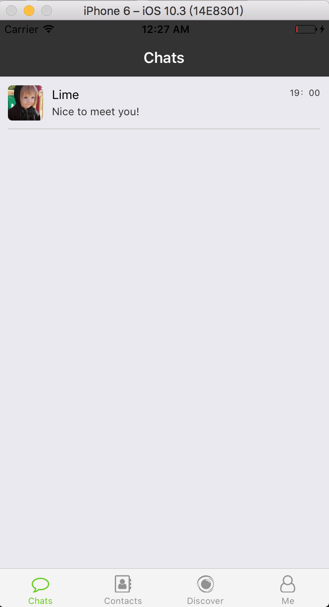

# learn-by-doing-ReactNative

# 目前包含主要依赖

- react-native
- react navigation
- react-native-vector-icons
- redux
- reselect
- immutable

# 期望

- 一个小应用：模仿微信

当前进度

- [x] 完成路由设计。
   - 四个 Tab: Chats、Contacts、Discover、Me
   - 路由间的跳转:
     - Chats -> ChatWith -> Profile
     - Contacts -> ChatsWith\Profile
     - Discover -> Moments -> Profile
     - Me -> MyPosts -> Profile
- [x] 完成添加朋友和聊天的 Store Design
   - 模拟从接口获取的朋友信息和最近聊天数据
   - 添加朋友，即可获得随机信息
   - 支持对话聊天，">+" 切换为对方输入
   - 更新聊天记录，和最近聊天信息

# 学习方式

- 参考官网文档
- Youtube

# 清单

- [ ] 朋友圈
- [ ] 我的相册

# 问题记录

[Amanda 的简书](http://www.jianshu.com/p/008732790f1e)

**观望 React Native 工作机会 **

# 屏幕截图

